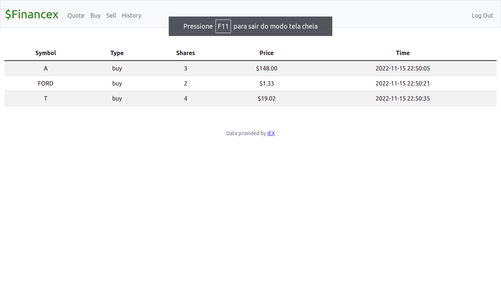

 

# ** Financex **

# ** A web application using flask and IEX API where users can buy and sell stocks. **

## ** How does it work **
### $Financex is web application that simulates the acquisition of stocks (or sell of the same).
### First you register or log in if you already have a account.
### Then you can buy stocks from the companies that you desire.
### All of your transactions will be register in the history section.

## ** How to run the application ? ** 

### First input in your terminal `API_KEY=pk_92c9a03c7e024b61bf575635b9d1bfa2`

### Then after that you can input `flask run` in terminal and go to the link that as created.
